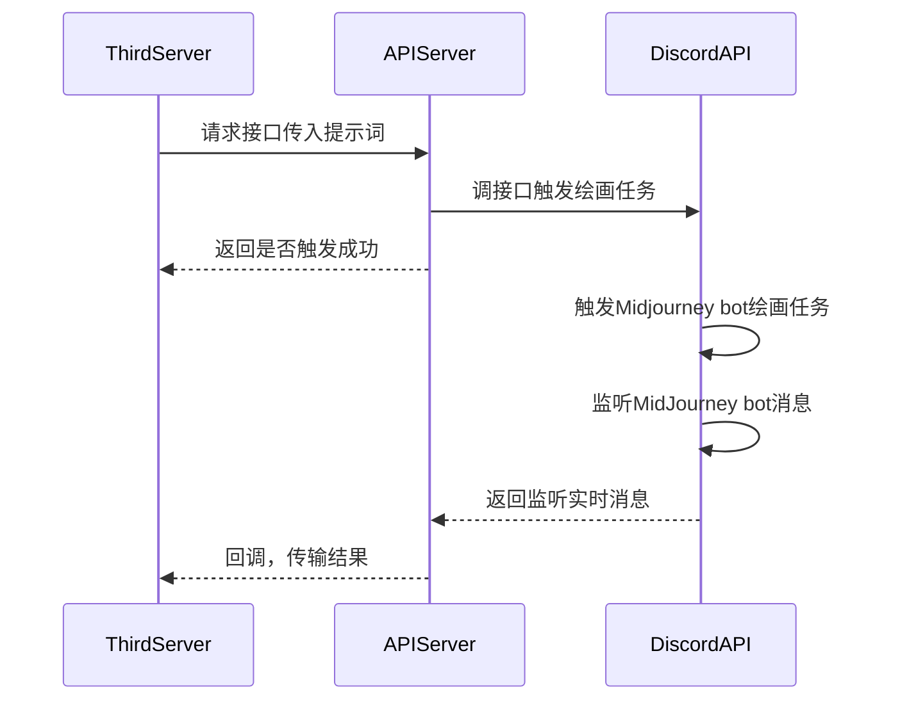

# midjourney-api

基于 Discord 的 Midjourney API。

使用教程参考：[Midjourney｜如何集成到自己的平台](https://mp.weixin.qq.com/s?__biz=Mzg4MjkzMzc1Mg==&mid=2247484029&idx=1&sn=d3c458bba9459f19f05d13ab23f5f67e&chksm=cf4e68eaf839e1fc2db025bd9940d0f5e57862f1788c88215b4a66cb23f553a30c5f37ac3ae8&token=79614426&lang=zh_CN#rd)

## UML



## 安装启动

```bash
git clone
poetry install
```

将文件`.env.template`重命名为`.env`，并填入参数值：

```
USER_TOKEN=用户token
BOT_TOKEN=机器人token
GUILD_ID=服务器ID
CHANNEL_ID=频道ID
CALLBACK_URL=回调地址，默认http post请求
```

### 直接启动

```bash
# discord会嵌入在fastapi内运行
python main.py
```

### 单独启动

1. 更改 `settings.py` 内 `DISCORD_EMBED_IN_FASTAPI_ENABLED = False`
2. 启动discord机器人：`python main_discord.py`
3. 启动fastapi：`python main.py`

### docker 启动 （需要更新）

填写 [start.sh](./start.sh) 中 `-e` 后的环境变量，直接启动：

```bash
sh start.sh
```

或者本地构建镜像：

```bash
# 构建镜像
sh build.sh
# 启动容器
sh start.sh
```

## 接口文档

### 文档地址

接口`swagger`文档：[http://127.0.0.1:8062/docs](http://127.0.0.1:8062/docs)

### midjourney 任务触发

- [x]  `/v1/midjounery/imagine`：触发绘画任务
- [x]  `/v1/midjounery/upscale`：U
- [x]  `/v1/midjounery/variation`：V
- [x]  `/v1/midjounery/reset`：重绘
- [ ]  `/v1/midjounery/upload`：上传图片，触发任务，待开发

### midjourney 任务查看

> :warn: 需要在 .env 中配置 `CALLBACK_URL=http://localhost:8062/v1/trigger` （默认地址，部署时需要调整域名）

- [x]  `/v1/trigger`：查看触发的任务

## 功能

- [x] 文生图
- [x] upscale
- [x] variation
- [x] reset
- [ ] 图生图
- [ ] integrate fastapi with websocket listening discord message.

## 其他

- [使用 curl 进行测试 midjourney](./docs/curl.md)

## enjoy it

---

